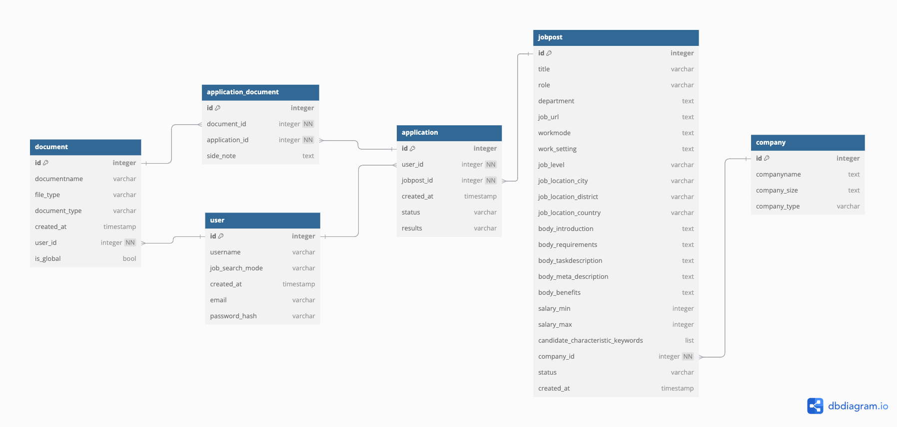

# Personal Job Navigator - Happy Job hunting

This is my side project to streamline my application process and make it more organized. It also serves as a fun tool to work with and to apply basic software engineering skills while maintaining tangible outputs and results. The goal is to build something simple but yet useful to integrate into personal job-application workflow.

It will serve to support the application process for interns, graduates, or professionals.

## Entity Relationship Diagram

Further information regarding the SQL structure can be found in the .sql file.
